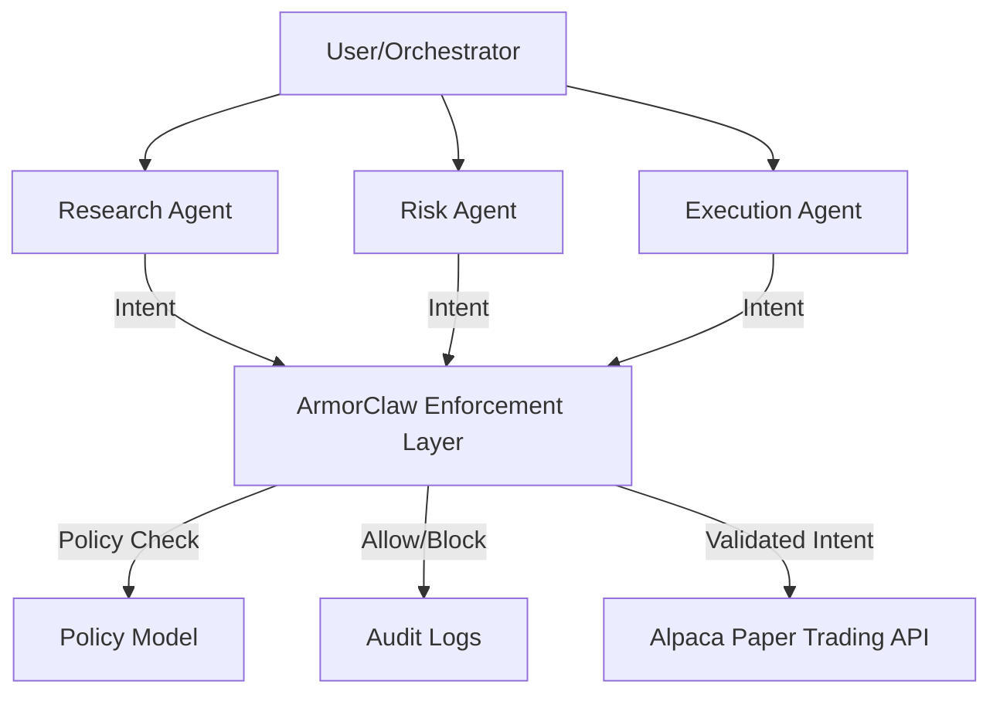

# ArmorClaw Financial Trading System

This is a production-style prototype of a **Delegation-Safe Multi-Agent Financial Trading System** built with TypeScript (simulating OpenClaw/ArmorClaw principles).

## Architecture



## Core Components

1.  **Orchestrator**: Coordinates the flow between agents.
2.  **Research Agent**: Analyzes markets and suggests trades (Permission: `ANALYZE`).
3.  **Risk Agent**: Validates suggestions against risk parameters (Permission: `VALIDATE`).
4.  **Execution Agent**: Executes trades on Alpaca (Permission: `EXECUTE`).
5.  **ArmorClaw Layer**: A strict middleware that intercepts all agent intents and validates them against a declarative policy before any external action is taken.

## Intent Model

```json
{
  "action": "BUY | SELL | ANALYZE | EXTERNAL_CALL",
  "asset": "string",
  "quantity": "number",
  "source_agent": "string",
  "risk_approved": "boolean"
}
```

## Policy Model

```json
{
  "max_trade_value": 10000,
  "max_quantity": 100,
  "allowed_assets": ["AAPL", "MSFT", "GOOGL", "TSLA", "NVDA"],
  "agent_permissions": {
    "research_agent": ["ANALYZE"],
    "risk_agent": ["VALIDATE"],
    "execution_agent": ["EXECUTE"]
  },
  "execution_requires": ["risk_approved"],
  "restricted_actions": {
    "execution_agent": ["EXTERNAL_CALL"]
  }
}
```

## Setup Instructions

1.  **API Keys**: Obtain Alpaca Paper Trading API keys from [Alpaca](https://alpaca.markets/).
2.  **Environment**: Add `ALPACA_API_KEY_ID` and `ALPACA_API_SECRET_KEY` to your environment variables (or `.env` file).
3.  **Run**:
    ```bash
    npm install
    npm run dev
    ```
4.  **Demo**: Use the dashboard to trigger the four required scenarios and observe the real-time audit logs.

## Security Features

-   **Deterministic Blocking**: No fuzzy logic; policies are strictly enforced.
-   **Delegation Safety**: Agents cannot perform actions outside their assigned scope.
-   **Resource Isolation**: Execution agents are blocked from making unauthorized external data calls.
-   **Auditability**: Every intent, decision, and policy trigger is logged with a timestamp.
